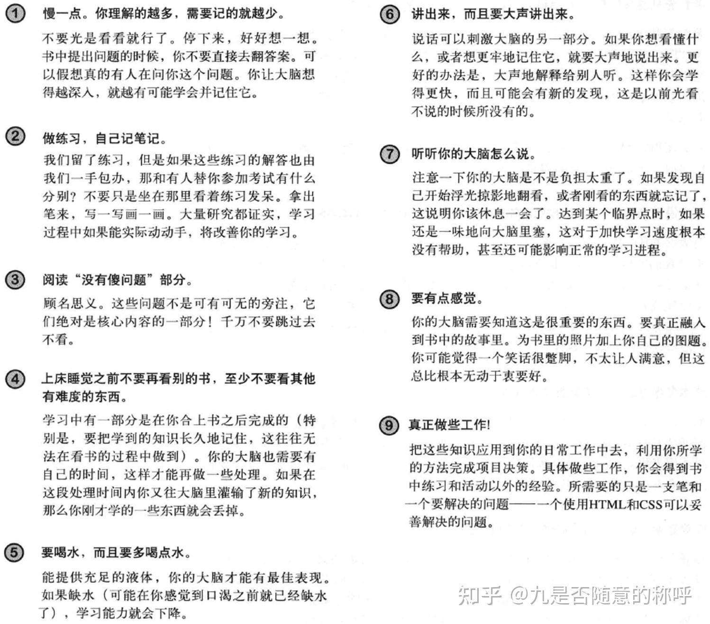

### 3.2 记忆

大脑的记忆容量是有限的，后来的知识容易挤走前面的知识，读书的话学生睡前少看电视

上床睡觉之前不要再看别的书，至少不要看其他有难度的东西。

学习中有一部分是在你合上书之后完成的（特别是，要把学到的知识长久地记住，这往往无法在看书的过程中做到)。你的大脑也需要有自己的时间,这样才能再做一些处理。如果在这段处理时间内你又往大脑里灌输了新的知识,那么你刚才学的一些东西就会丢掉。

要喝水，而且要多喝点水。

能提供充足的液体，你的大脑才能有最佳表现。如果缺水（可能在你感觉到口渴之前就已经缺水了)，学习能力就会下降。

做练习，自己记笔记。

我们留了练习，但是如果这些练习的解答也由我们一手包办，那和有人替你参加考试有什么分别?不要只是坐在那里看着练习发呆。拿出笔来，写一写画一画。大量研究都证实，学习过程中如果能实际动动手，将改善你的学习。

来自书籍的《Head First HTML与CSS 第2版》

  
