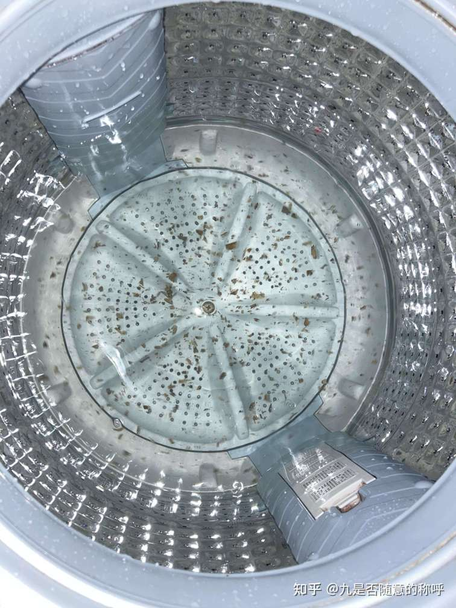
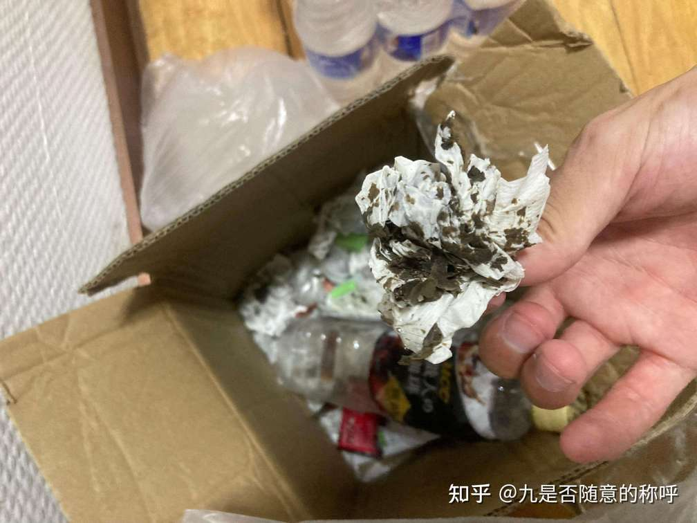

### 4.2 头皮屑

自从去年剃光头以后，现在又有很多头皮屑了，可能是头皮真菌感染了，可能是剪头发的时候交叉感染的，也可能是手指太脏了，偶尔手指触到头皮感染的，也可能是献血以后皮肤层的血液量减少导致的，也可能是免疫力下降导致的。

总之，又有很多头皮屑了，得来点盐酸特比萘芬片了

我想明白为什么用12片（兑6升水）次氯酸消毒洗衣机的时候有这么多污垢出现了，主要还是次氯酸消毒能力太好了，之前洗衣机上附着了很多细菌和真菌，它们分泌了很多粘液，即使是平时用洗衣机洗衣服，脱水都不能弄掉这些附着的微生物，次氯酸基本能灭掉所有的微生物，所以细菌和真菌失活以后，不能继续附着在洗衣机上，就出现了很多污垢的，说明了次氯酸片是正品有效果，次氯酸消毒能力真好，平常的家用消毒液根本达不到这个效果，说明家用消毒液消毒能力没有次氯酸好。男生还是需要梳子的，梳子还是有必要。

  

  
